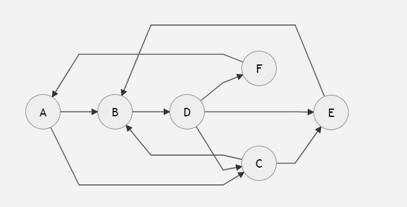
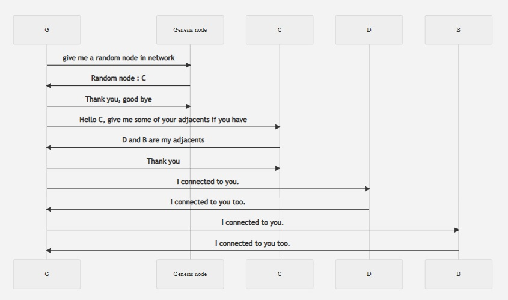
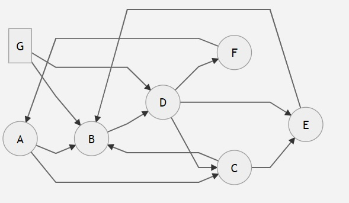

# P2P  Network Project 

# THE PROJECT


### What is Peer-to-Peer Network

P2P network is a distributed network architecture that doesn't need a central server for communication. In p2p network, each computer that joined the network called Peer (or Node) and they are connected to each other directly. Mainly this network is used in file sharing and blockchain applications.


### About the project

This project is a simple implementation of a peer-to-peer network using Python. The project will include the
following features:
-   **Node creation**: Each node will have a unique id and will be able to connect to
other nodes.
-   **Message sending**: Each node will be able to send messages to other nodes.
-   **Message receiving**: Each node will be able to receive messages from other nodes.
-   **Node discovery**: Each node will be able to discover other nodes in the network.
-   **Network visualization**: The network will be visualized using a graph library.
-   **Node removal**: Each node will be able to remove itself from the network.
-   **Network shutdown**: The network will be able to shut down.
-   **Node status**: Each node will be able to check its status in the network.
-   **Network status**: The network will be able to check its status.
-   **Network size**: The network will be able to check its size.


### How does it work

The project will use the following components:
-   **Node class**: This class will represent each node in the network. It will have methods
for connecting to other nodes, sending messages, receiving messages, discovering other nodes,
removing itself from the network, checking its status, and shutting down the network.
-   **Network class**: This class will represent the network. It will have methods for
discovering nodes, checking the network status, and shutting down the network.
-   **Graph library**: This library will be used to visualize the network.
-   **Message class**: This class will represent messages sent between nodes.
-   **Connection class**: This class will represent connections between nodes.
-   **Discovery class**: This class will be used to discover other nodes in the network.
-   **Status class**: This class will be used to check the status of nodes and the network
-   **Shutdown class**: This class will be used to shut down the network.

### File structure
```bash

│   commands.py
│   Message.py
│   Network.py
│   Node.py
│   node1.py
│   node2.py
│
│
├───helpers
│   │   cmd_helper.py
│   │   terminal_helper.py
│   │   __init__.py
│
│
├───settings
│   │   includes.py
│   │   terminal_set.py
│   │   __init__.py
│
```
<br>
<br>

## Usage


In **Node .py** file , there a **Node class** , which includes all attritibues and methods  of a Node. 

Network.py consists of a **Network class** which inherited from  Node class. So, a connection is established by using an instance of this class. 

In Node class, there are GENESIS_NODE_ADDR and GENESIS_NODE_PORT variables which is the genesis node's connection address known by everyone.


To starting genesis node,
```python
from Network import Network

peer = Network("localhost") #Node instance is created
peer.start(5050)

#Genesis node is created and started 


data=input()

while(True):
	peer.broadcast(data)
	data=input()

```
for example, If you want to create another peer except for Genesis node, you should apply the same process for different ip address and port. (If you run this p2p network on your local network, each pear must start with on different port.)

```python
from Network import Network

peer = Network("localhost") #Node instance is created
peer.start(5051)

#A peer started

peer.join_network()
data=input()

while(True):
	peer.broadcast(data)
	data=input()

```
**broadcast method**, sends a broadcast json formatted message to all other peers in the network . It is guaranteed that all peers receive the broadcast message. This message includes message id, title, message , and timestamp. 

Here is an example of the message.
```
{
'id': 'fbc019f3a87787f904b54875f62e2193445f0e0f4e82f6978d77dbe29d7a9894',
'title': '#BROADCAST',
'message': 'Hello world',
'time': 1617555967.1199386
}

```
# More
This peer to peer network is unstructured. It means that network is created randomly. Each node has more than 2 peers. For example assume that there are 6 peers in the network. If you draw nodes and connections, it will be a network like that



As you see, it is very complicated structure, and it is very hard to guess the structure since connections established randomly. 

To understand clearly , assume that a new node **G** want to join this network. The schematic presentation of this process will be like that. 





**After this process, the next presentation of graph will be like this  :**




